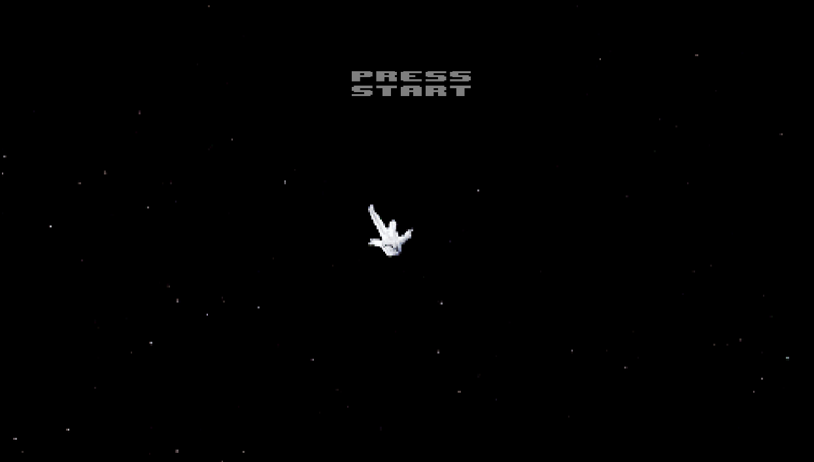
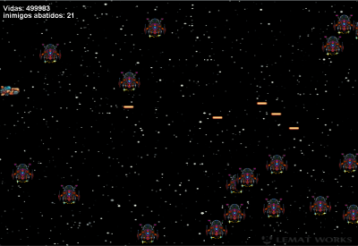
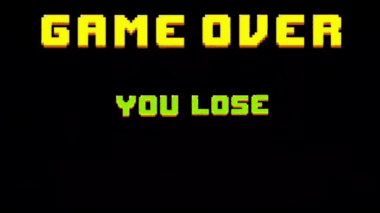

# 🌌 **War in the Stars**  

Welcome to **War in the Stars**, an exciting 2D game set in epic intergalactic battles!  
In this pixelated universe, you will control a starship and face relentless waves of enemies while exploring the depths of outer space.  

---

## 📖 **Game Description**  
In **War in the Stars**, you are the commander of a high-tech spaceship armed with cutting-edge weapons.  
Your mission? Survive unyielding waves of enemies, collect power-ups, and become the ultimate space hero.  
Get ready for a fast-paced, action-packed journey through the galaxy!  


## 📖 **Game stage**
The game is currently in the alpha stage

---

## 🎮 **Features**  
- 🚀 **Dynamic Gameplay**: Test your reflexes in intense space battles.  
- 💥 **Power-Ups**: Upgrade your spaceship and weapons as you progress.  
- 🌟 **Retro Graphics**: A nostalgic 2D design inspired by classic arcade games.  
- 🎶 **Epic Soundtrack**: Immerse yourself in the universe with a galactic-themed score.  

---

### Main Menu


### Gameplay


### Game Over


## 🚀 **How to Play**  
1. **Download the Game**: Clone the repository:  
   ```bash
   git clone https://github.com/your-username/war-in-the-stars.git
   cd war-in-the-stars
